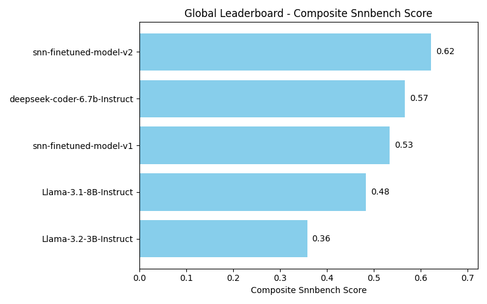
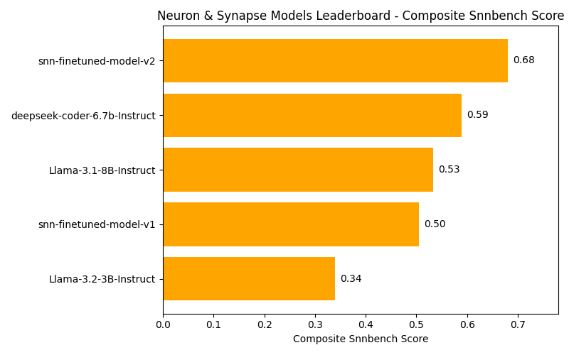
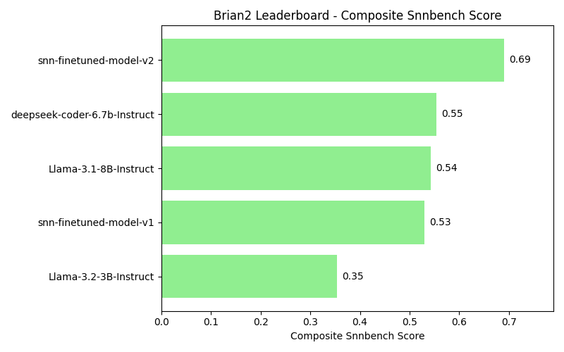

# 🧠⚡ Spiking-CODER
*Fine-tuned LLMs for Spiking Neural Network (SNN) Programming Problems*

---

## 📌 Overview
Spiking-CODER is a research project that introduces **two large language models (LLMs) fine-tuned specifically for Spiking Neural Network (SNN) programming tasks**.  
The base model that we fine-tuned on is Llama-3.1-3B-Base.

This work was conducted under the NVM and Neuromorphic Hardware Research Group at IIT Delhi.

The repository contains:
- **`Fine-tuning/`** – Script for model fine-tuning  
- **`data generation/`** – Data generation scripts for v1 and v2 models  
- **`evaluation/`** – Model responses, leadership, and performance plots  

Both models have been evaluated on syntax, semantics similarity based on prompt, imports, and functional pass rates to benchmark their usefulness for SNN programming.

---

## 🚀 Models
- **Spiking-CODER v1**  
  Sequentially trained, first on 50k samples of raw SNN code and then 100k synthetically generated SNN prompt-output pairs by Deepseek-coder-6.7b-Instruct and Llama-3.1-8B-Instruct based on seed snippets collected from SNN github repos.  

- **Spiking-CODER v2**  
  Trained on 40K different code samples collected from different github repos. This time, the output only consisted of human written raw SNN code while the prompts were synthetically generated by Mistral-Large based on the code output.  

---

## 📊 Evaluation

### Global Leaderboard (Composite Score)

### Category Leaderboards (Example)

### Framework Leaderboards (Example)

---

### 📈 Metrics
We evaluate each model on:
- **Syntactic Pass Rate** → AST parse success  
- **Semantic Score** → Rule-based keyword coverage  
- **Import Pass Rate** → Correct framework imports  
- **Functional Pass Rate** → Executes without runtime errors  
- **Composite SNNBench Score** → Weighted combination of all the above  

